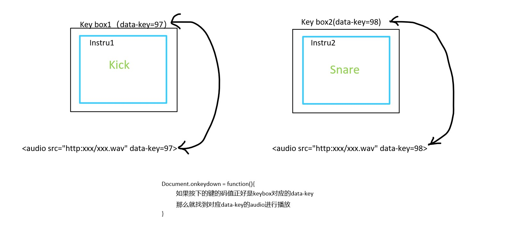
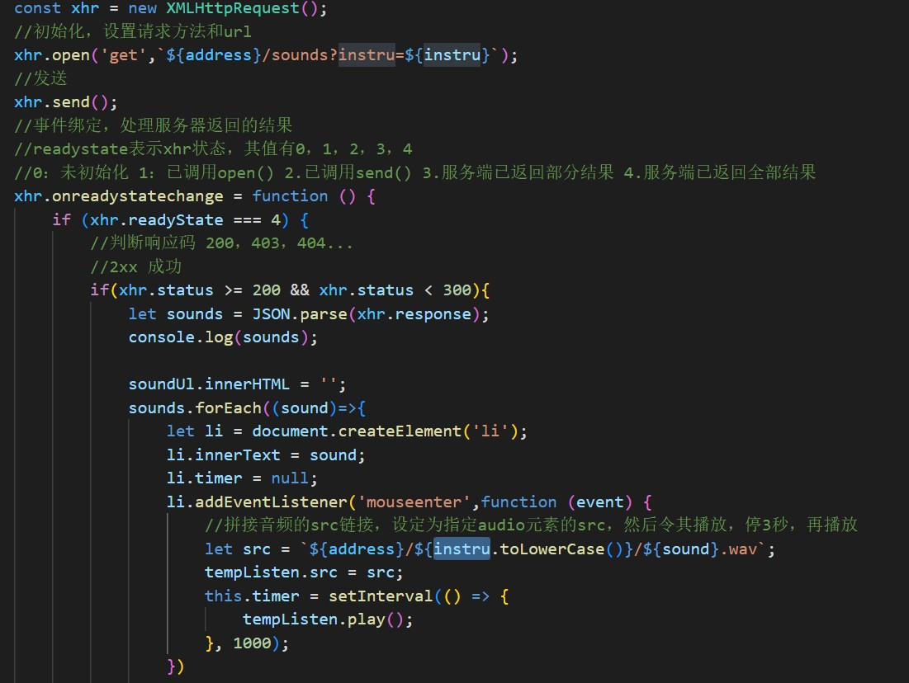

# 项目解析指南

## 前言

这个小项目是对JavaScript Drum Kit(JavaScript-30days-Challenge项目中的第一个挑战)的一个扩展，我想给他添加一些功能，变成一个更加好玩的玩意。接下来讲下我的设想。

## 我的设想

1. 可以演奏一种主乐器，如钢琴，吉他等，可以同时容纳两个八度
2. 设定n个以下的打击乐器，每一种乐器都可以有多个选择的音效
3. 演奏可以异步进行，每个音按下时持续播放，松开时暂停播放
4. 默认主乐器按键和打击乐器按键是固定的，但用户也可以自定义更改，其中打击乐只能在数字键盘中按键生效，主乐器的按键区域尽量在字母区
5. 用户可以录制演奏过程，在录制完成后会生成谱子，可上传谱子到服务器分享给其他网友参考

## 要解决的主要问题

1. 异步演奏的问题  
由于在JavaScript Drum Kit中音频的播放时间都很短促，所以也不知道其是同步还是异步播放的，所以我们还是得找两个播放时间长一点的音频来验证。如果原来的方法可以，就直接复用原来的，否则自己再研究下。  
原来的播放模式就是异步的，但松开时仍继续播放，现给每个按钮添加keyup事件  
原来的逻辑，持续按下时currentTime会一直被重置为0，这里我们想要的效果是，持续按下时，如果音频已经在播放，那么就让它继续播放，当松开按键时才停止播放。  
因为没有判断是否在播放的api，所以这里我们只能自己手动加flag进行判断，给每个audio标签带上一个data-isplaying，在play时将该flag设为true，松开键时设为false，然后每次按下键判断flag是否为true，即判断是否在播放，如果已经播放则直接返回  
2. 浏览器用ajax向服务器请求音频资源并得到音频  
目前只接触过express后台服务框架，所以暂时用这个来做  
直接把音频文件放入public文件夹中，然后用express.static()方法托管为静态文件，可以直接通过http协议+路径访问到这些资源文件，audio的src属性可以直接写url  
有一个问题，当我再次使用该资源时，它是直接取缓存里的文件还是真的又去访问url一遍？  
答案是如果url不变，那么它会使用缓存里的，如果url变了，那么它会去访问url所在的资源。  

## 需求分析

这个项目可以分成三个模块，一个是主乐器，一个是打击乐器，还有一个是录制模块。  
对于主乐器，我是这样想的，给用户提供自由选择两个八度区，一个为低音的八度，另一个为高音的八度，按键默认（我们先设置好合适的按键位置，后期看需求要不要给它设置一个修改按键功能），另外,用户可以额外自定义10个音符按键（默认界面上没有，需要用户自己去设置）  
对于打击乐器，用数字键盘作为按键，且有明确分类，比如大鼓1，大鼓2，镲1，镲2，小鼓1，小鼓2，特殊1，特殊2，特殊3，特殊4。一个打击乐器就是一个box，每个box的乐器种类默认是固定的，但对应按键可以换；用户单击它，就可以在其乐器种类中选择合适的音源，双击它，换按键位置(只能是数字)。  
录制模块，目前还没想好

## 功能设计与实现

### 打击乐器部分

- 实现简单的位置调换(可跳过)

由于每个box对应的按键是可以改的，有时候一个box按键从1改成了2，但在布局上没有改，看着就有问题，为了解决这个问题，我们先搞个调换位置的demo(box调换位置.html)。  
写完这个demo我才知道，insertBefore这个方法，如果你传的插入节点是原节点的话，它会直接拿原节点插入到指定位置，在页面上能直接看到原节点元素位置改变的效果。

- 通过位置调换来修改按键

是这样的，我仔细想了下，不应该是先手动修改按键，然后手动调换位置，而是用户主动调换位置后，引起了box对应的音源的变更，比如原本按键1是大鼓，按键2是镲片，用户在界面上把这两个元素进行交换后，按键1是镲片，按键2是大鼓。  
那我的想法是，给每个box外层套一层KeyBox，每个keybox对应按键不变，当keybox里的元素发生变更时，给新的子元素绑定键盘事件。但检测子元素是否变更目前以我的实力难以办到，所以换个思路，在点击交换按钮时，获取你现在使用的乐器种类和你想要交换的那个乐器种类子元素，以及他们的外层keyBox，然后把两个keyBox的子元素交换一下，交换之后，两者的音频源也要进行交换，这样才能让交换后的乐器种类还是原来的音源，这里的逻辑确实比较复杂，我画个图再给自己讲一遍。  
首先，怎么让一个box具有按下按键播放音乐的功能呢？  
  
很简单，给box添加上一个键码的信息，再给audio添加上键码的信息，当文档检测到这个键码被按下时，让box外观发生一些变化告知用户是当前这个box在控制这个音源的播放，然后找到对应键码的audio，调用让其播放的API。在JavaScript Drum的例子中就是这么做的。  
我们现在面临的问题是，用户觉得音源和按键绑死不太好，比如上图中，keybox1的音源是kick，keybox2的音源是snare，用户想通过某种交互方式后，交换两个音频的按键，在按下键码为97的按键时，让snare播放，而不是kick，同理对于keybox2，在按下98时，让kick播放，原因只是他觉得这样顺手些。  
我的解决思路是，在用户使用某种交互方式后，我们的程序要获取到Instur1和Instru2这两个内部的box元素，然后将这两个box对调，这是界面上呈现的效果，这意味着，我的按键97对应着Snare这个音源，98对应Kick，但目前97的audio的音频源src还是指向kick的音频文件，也就是说，按下97播放的还是kick，所以在程序内，我们还要把这两个音频源进行对调，只要audio的src对调即可，data-key始终与keybox的data-key保持一致。daya-key的作用就是把界面上的box与音频源进行连接绑定，当用户按下按键时，document触发回调函数，找到对应键码的keybox和audio，keybox负责界面上的外观变化，audio负责音频控制。关键思路就是这样，具体实现细节看项目代码，这里不再赘述。  

#### 代码实现后出现的一些问题

目前打击乐器模块完成了80%了，接下来把界面美化一下就差不多了。然而在代码实现上有一些小问题，虽然不影响大局，但还是抽象出来总结一下比较好。  

- 问题一
看一下这段代码  
  
这段代码有两个小问题，第一个问题是，直接看高亮的那个变量，声明的地方在非常外层的地方，且在那个非常外层的那一层有用到，然后可以看到，这个变量在非常内层的地方又用到了，这就造成了高耦合的问题，像这样的变量还不止一个，具体有instru，keyBox。其实这里高耦合目前也没什么影响，硬要说“影响”就是动态生成的li标签与其附近的dom元素进行深度绑定，如果将来打击乐器模块中的dom结构发生变化，那么很有可能会影响li标签的属性或方法，所以如果要优化，在给li设置属性或方法时，尽量屏蔽掉dom结构,根据dom结构获取一些数据的代码放到外层去处理。  
还有一个小问题老生常谈了，就是回调地狱的问题，对于目前这块代码的话，因为是ajax请求后获取数据然后根据数据动态添加dom元素，并给这些dom元素添加属性和方法，那么可以用yield方法来将其分成逐个任务依次处理，先请求拿到数据，然后根据数据生成dom元素，给dom元素添加属性方法；也可以直接用promise相关的方法比如fetch，或者直接就用原生promise。这里我采用fetch，现成的promise封装好的方法。(老代码在index_old中，现代码在index中)  

### 主乐器部分

这部分的js我打算使用jquery来写，优点是可以节省很多代码量。在主乐器部分的js文件里导入jquery.js即可。  

```javascript
import "./jquery-3.5.1.js"
```

然后在写这部分之前，我们先把之前的代码优化整理下，每个弹奏的小盒子，应当封装起来供复用。  
写着写着发现，应该一开始就建立一个弹奏盒子模型，然后根据这个盒子模型来写的，直接sb了。  
这个封装还有点复杂，我是这样想的，在构造一个弹奏盒子后，其内部产生一个audio,并给document增加一个监听器监听设置的按键，这样的话，改动还是蛮多的，原来的思路是当有键按下时，程序会去在文档中找到那个audio元素然后play，现在的话，就省掉了搜索的过程直接play，理论上会比原来的快一点。  
然后封装过程中遇到了一个棘手的问题，我在一个div中写了一些文字，这个div的大小是变化的，我想让文字大小随着div大小的变化而变化，怎么做？  
目前是找了一个第三方库解决了。  
